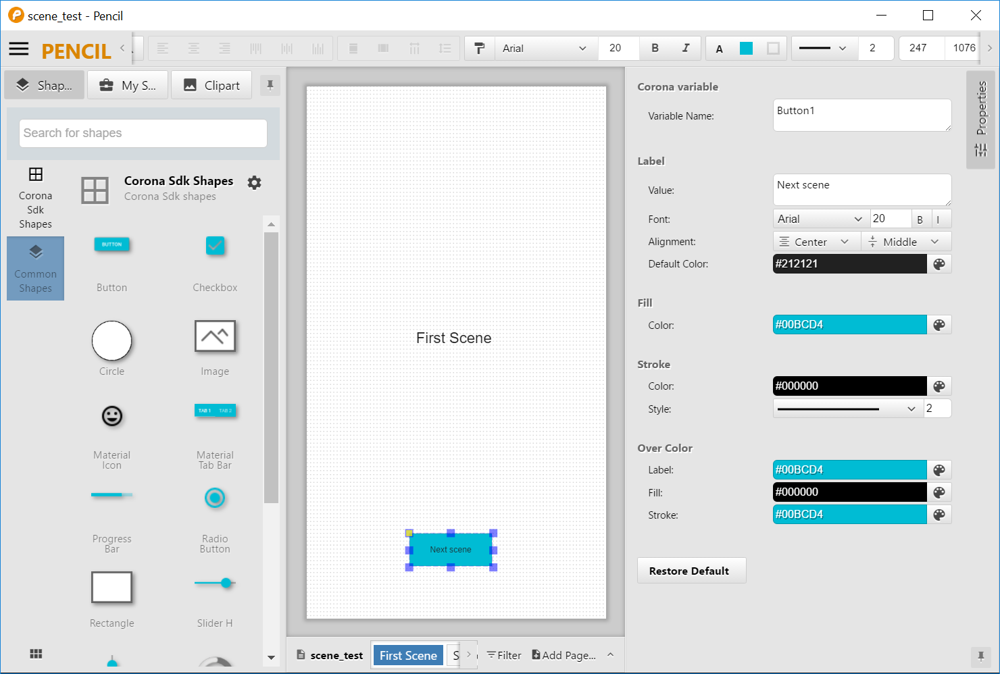
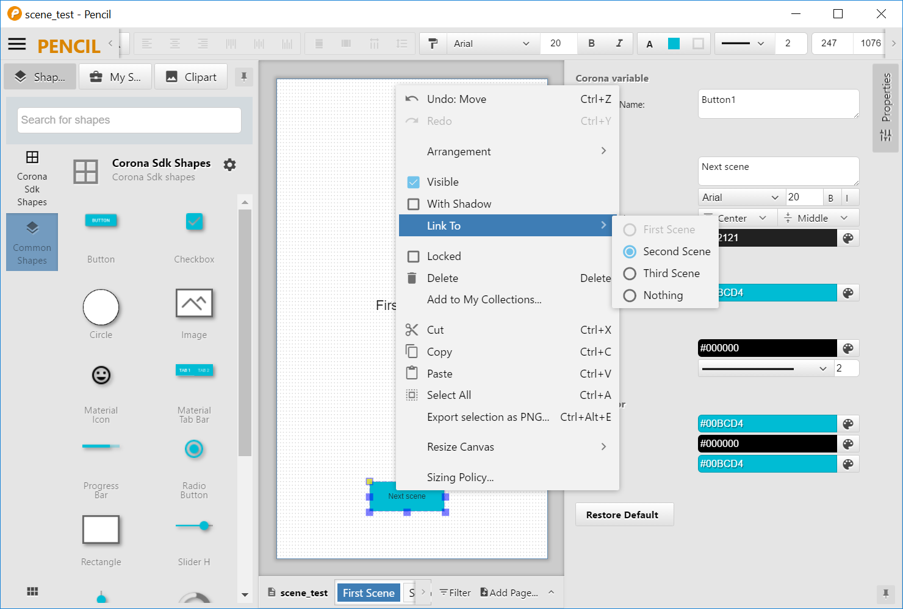
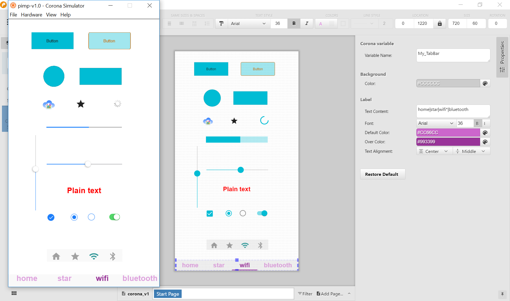

# pimp-v1.0
Pencil UI design importer for Corona Sdk


## Installing Corona Sdk stencils for Evolus Pencil
Download the latest version (3.0.4) for [Pencil](https://pencil.evolus.vn/)
* Select "Tools/Manage Collections" from menu. 
* Click on the "Install from file" button and locate the stencil file CoronaSdk-Pencil-Stencils-v1.0.
* Open the sample design from "epz" folder.

### Tip
If the design contains page named 'Icon', Pimp will not import the page layout, only the images on the page as icons... 
* These files are usefuls for building your own project using Pimp generated files.


## Preparing Pimp for import
To change the current configuration modify the `main.lua` file

main.lua:
```
local importFile = "epz/scene_test.epz"
local exportDir = "export" 
display.setDefault( "background", 1,1,1,1 )	
```

## Generating and running UI design
Execute Pimp project with Corona Simulator.
* Pimp will export generated files to `exportDir`. After generation finshed the program executes the **first page** of the UI design pages.
```
local function pimpDone(prjName, startPage)
  pimpCore.setDir(exportDir)
  composer.gotoScene(exportDir.."."..startPage)
end
pimp.import(importFile, exportDir, pimpDone)
```

## Modifying exported files
After the first execution the export directory will be created and filled with sources generated prom page layouts.
```
export\
  FirstPage.lua
  pimp_FirstPage.lua
  SecondPage.lua
  pimp_SecondPage.lua
  ...
  refs\
    xxx.png
    yyy.png
  Icon.png
  Icon_128x128.png
  ...
```
The files named 'pageName.lua' very simple scene templates which are can be modified by the user while once generated never will be overwritten.
* The files staring with 'pimp_' are core UI desing container files and always will be replaced if the 'pimp.import' called.

### Using generated Corona objects
Generated scene template is very simple:
```
local pimp = require "export.pimp_FirstScene"
local composer = require "composer"
local scene = composer.newScene()

function scene:create(event)
  local sceneGroup = self.view
  local objects = pimp.getSceneObjects(event,sceneGroup)
end
```
To access object just use the assigned Corona variable name on the Pencil interface.
```
function scene:create(event)
  local sceneGroup = self.view
  local objects = pimp.getSceneObjects(event,sceneGroup)
  objects["My_Spinner"]:start()
end
```




