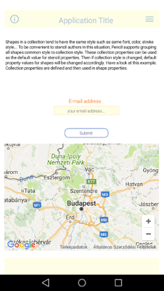
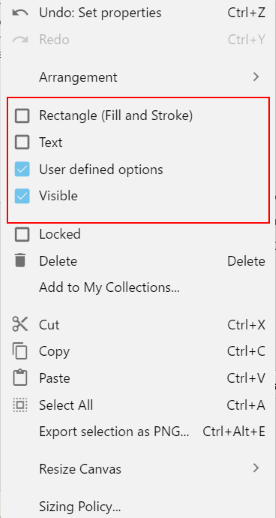

# pencil-imp4corona v1.1
Pencil UI design importer for Corona Sdk



## Supported widgets
Implemented elements:

* Rect (RoundedRect)
* Circle
* Text
* Button
* Spinner
* Image
* Switch (CheckBox,Radio)
* Slider
* ProgressBar
* Tabbar

non standard Corona SDK elements
* MaterialIcon (newText with Material Icon font set)
* MaterialTab (newTabbar with Material Icon font set)
 
Native objects (Generic Objects)

* TextField
* TextBox
* WebView
* MapView


## Installing Corona Sdk stencils for Evolus Pencil
Download the latest version (3.0.4) for [Pencil](https://pencil.evolus.vn/)
* Select "Tools/Manage Collections" from menu. 
* Click on the "Install from file" button and locate the stencil file CoronaSdk-Pencil-Stencils-v1.1.
* Open the sample design from "epz" folder.

You'll need also "MaterialIcons" font for Material Icons based objects (MaterialIcon, MaterialTabBar).

### Tip
If the design contains page named 'Icon', the importer will not import the page layout, only the images on the page as icons... 
These files are usefuls for building your own project using the generated files.


## Preparing the import
To change the current configuration modify the `main.lua` file

main.lua:
```
local importFile = "epz/scene_test.epz"
local exportDir = "export" 
display.setDefault( "background", 1,1,1,1 )	
```

## Generating and running UI design
Execute the project with Corona Simulator.
The program will export generated files to `exportDir`. After generation finshed the program executes the **first page** of the UI design pages.
```
local function pimpDone(prjName, startPage)
  pimpCore.setDir(exportDir)
  composer.gotoScene(exportDir.."."..startPage)
end
pimp.import(importFile, exportDir, pimpDone)
```
If you want make the release from imported and generated files, you can do it simple.
```
local composer = require "composer"
local pimpCore = require "pimp.pimpCore"

-- directory of generated files
pimpCore.setDir("myapp")
	
-- start a scene
composer.gotoScene("myapp.AppMenu")	
```
## Modifying exported files
After the first execution the export directory will be created and filled with sources generated prom page layouts.
```
export\
  FirstPage.lua
  pimp_FirstPage.lua
  SecondPage.lua
  pimp_SecondPage.lua
  ...
  refs\
    xxx.png
    yyy.png
  Icon.png
  Icon_128x128.png
  ...
```
The files named 'pageName.lua' very simple scene templates which are can be modified by the user while once generated never will be overwritten.
The files staring with 'pimp_' are core UI desing container files and always will be replaced if the 'pimp.import' called.

### Using generated Corona objects
Generated scene template is very simple:
```
local pimp = require "export.pimp_FirstScene"
local composer = require "composer"
local scene = composer.newScene()

function scene:create(event)
  local sceneGroup = self.view
  
  -- render design elements
  local objects = pimp.getSceneObjects(event,sceneGroup)
end
```
To access object just use the assigned Corona variable name on the Pencil interface.
```
function scene:create(event)
  local sceneGroup = self.view
  
  -- render design elements
  local objects = pimp.getSceneObjects(event,sceneGroup)
  
  -- use generated object
  objects["My_Spinner"]:start()
end
```

## Designing layouts with Pencil

* Drag and drop selected UI element from the 'Corona Sdk Shapes' collection on to the layout.
* To set properties of the object you can use the 'Properties panel' on the right, or the layout panel on the top.
* Right click on the object if you want set additional parameters ( visibility, pageLink, image content etc.)

### Special features Corona sdk
* If 'Link to' options selected from the popup menu, it will be implemented as composer.gotoScene( pageName ) command.
* To assign content to an image object use the 'Action/Load linked image...' option from the popup menu. The image will separately exported to the 'refs' folder and used automatically at runtime.
* Generic object has special flags to control which parameters can be used by importer/generator code.

* Generic objects ( corona native.* ) has additional parameters like handler function, and user defined table properties. The list of properties should be separated and ended by comma!!!


## Pencil UI designer screenShots


